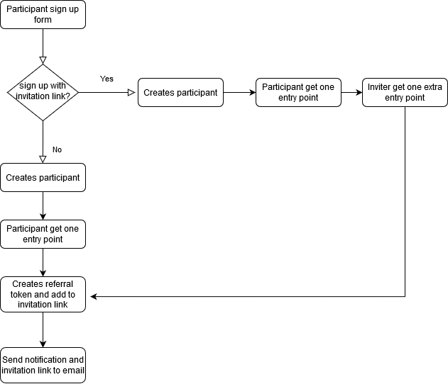

# README
In this project, a simple webpage was built to spread the news about a new product.
The user will fill in the registration form, after filling in and submit the form,  user will receive an email notification that the registration was successful and get one entry point for the competition.
The email sent contains a link that can be shared with others.
if someone else fills out the form of the link that is shared then the original link poster will get an extra entry.

The system generates token from Participant.id and time when object participant was created. That token becomes a parameter for a registration link. So when someone submits the form from the registration link that contains a token as a parameter, the original poster will get an extra entry.

This project doesn't have a feature to set the date when the webpage can be accessed and the date when the webpage expires. I have searched which method to implement those features maybe I can use cache but I still don't know if it's gonna work or not.

* Ruby version : 2.7.1

* Rails version : 6.0.3.2

The system flow diagram can be seen below:

